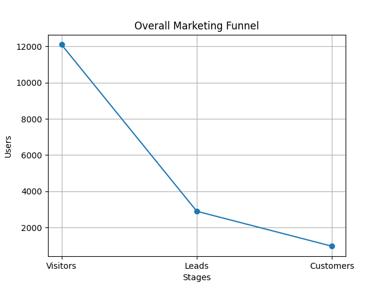
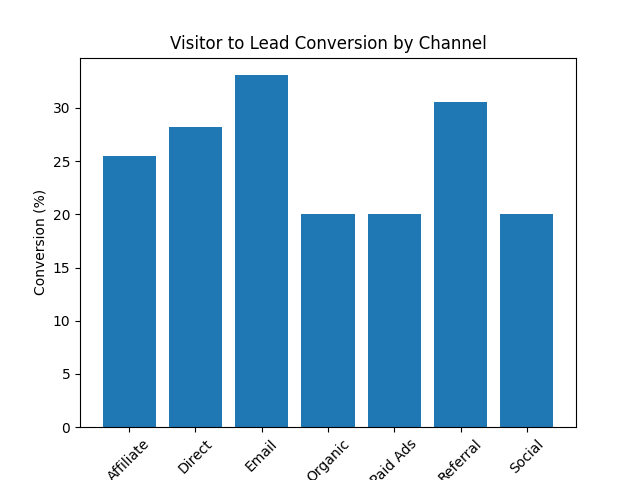
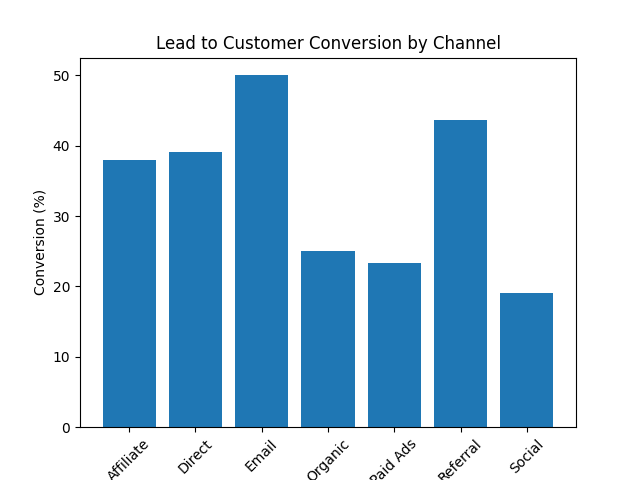
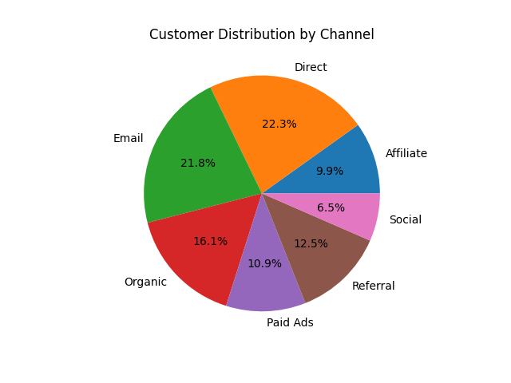
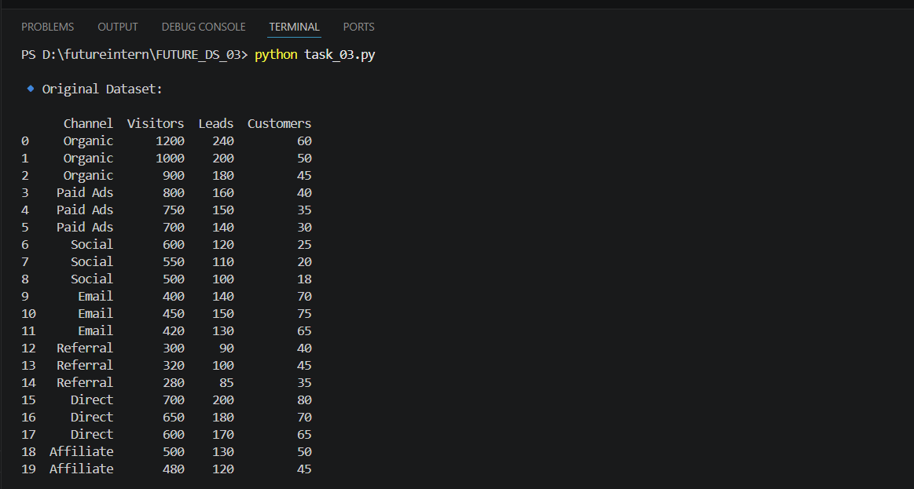
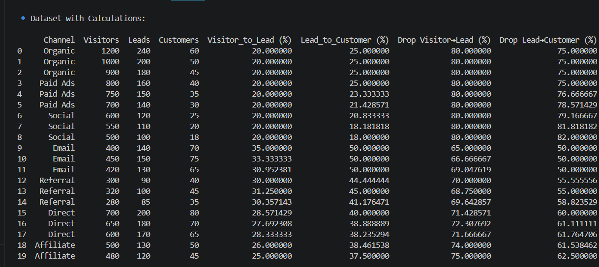
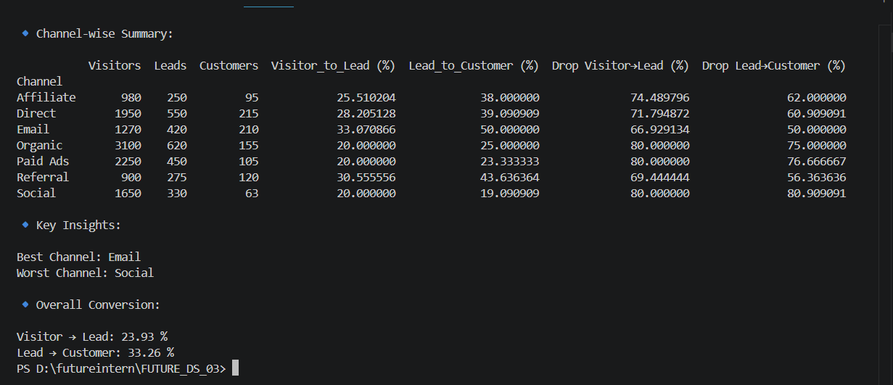

# 🚀 Marketing Funnel & Conversion Performance Analysis (Task 03)


---

## 📊 Project Overview
This project analyzes the **marketing funnel performance** across channels to track the user journey:

**Visitors → Leads → Customers**

**Objectives:**
- Calculate **conversion rates** at each stage  
- Identify **best & worst performing channels**  
- Detect **funnel drop-offs**  
- Provide **actionable recommendations** for improvement  

---

## 📁 Dataset
- File: `data.csv`  
- Total Records: 20  
- Columns:
  - `Channel`
  - `Visitors`
  - `Leads`
  - `Customers`

---

## 🛠️ Tools & Tech Stack
- Python 3  
- Pandas (Data Analysis)  
- Matplotlib (Visualization)  

---

## 💡 Key Insights

<div style="background-color:#eaf8e0;padding:10px;border-left:5px solid #4CAF50;">
✅ <b>Best Performing Channel:</b> Email
</div>

<div style="background-color:#ffe6e6;padding:10px;border-left:5px solid #FF4C4C;">
⚠️ <b>Lowest Performing Channel:</b> Social
</div>

<div style="background-color:#fff3cd;padding:10px;border-left:5px solid #ffc107;">
📈 <b>Overall Conversion Rates:</b>
- Visitor → Lead: <b>23.93%</b>  
- Lead → Customer: <b>33.26%</b>
</div>

---

## 📊 Visualizations

### 🔹 Overall Marketing Funnel


### 🔹 Visitor → Lead Conversion by Channel


### 🔹 Lead → Customer Conversion by Channel


### 🔹 Customer Distribution by Channel


---

## 🖥️ Terminal Output

### 🔹Original Dataset


### 🔹 Dataset with Calculations


### 🔹Channel-wise Summary, Final Insights & Conversion


---

## 🚀 How to Run

```bash
pip install pandas matplotlib
python task_03.py
```
---
## 📂 Project Structure
FUTURE_DS_03/
│── task_03.py
│── data.csv
│── funnel.png
│── visitor_to_lead.png
│── lead_to_customer.png
│── customer_distribution.png
│── output1.png
│── output2.png
│── output3.png
│── README.md
---
## 👨‍💻 Author

Teja Aswani


